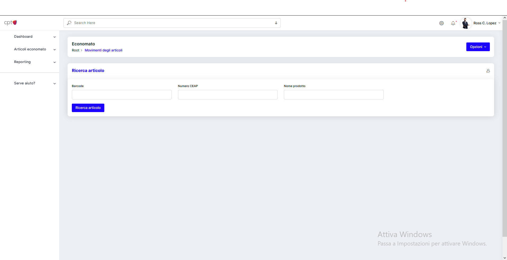
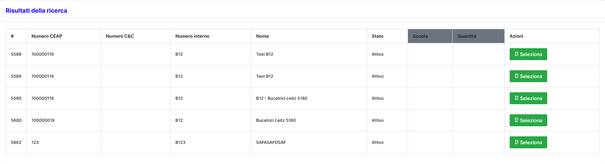

## Panoramica

Tramite questa pagina è possibile registrare i movimenti di tutti i singoli articoli.
Di seguito lascio una panoramica di come dovrebbe apparire la scheda appena caricata:

## Ricerca di un'articolo

Nella prima cella chiamata <strong>Ricerca articolo</strong> sono presenti tre campi di immissione, ogunno con una ricerca specifica.
- ** Barcode **: questo campo viene utilizzato in presenza di un lettore di codici a barre
- ** Numero CEAP **: questo campo viene utilizzato per effettuare ricerche sul numero CEAP, numero del fornitore. Solitamente un numero
- ** Nome prodotto **: con questo campo è possibile effettuare una ricerca per nome parziale/completo e anche per numero interno (B12).

### Risultato della ricerca

Dopo aver effettuato la ricerca apparirà una tabella con tutti gli articoli che corrispondono alle condizioni ricercate.
Per selezionare un'articolo, utilizzare il pulsante apposito color verde <strong>Seleziona</strong>. Visivamente la tabella apparirà simile alla seguente:

## Timeline dei movimenti

Dopo aver selezionato il prodotto, nella parte inferiore dello schermo, appariranno due celle affiancate. Una con una timeline e l'altra con un form di immissione dati.
Questo capitolo pone l'attenzione sulla timeline dove vengono mostrati tutti movimenti che il prodotto ha avuto.

Questa timeline analizza solo il dettaglio sulla quantità dell'articolo, facendolo in modo cronologico, dal più recente al meno recente.

