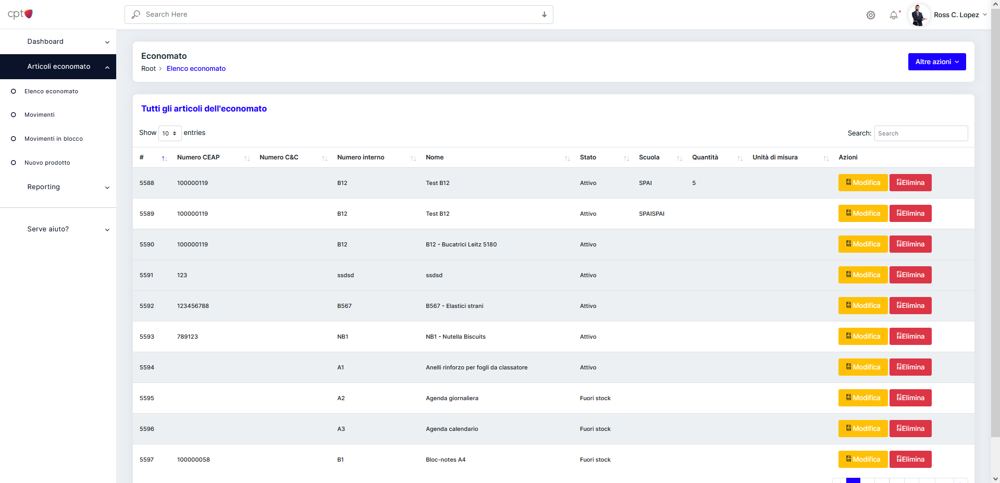
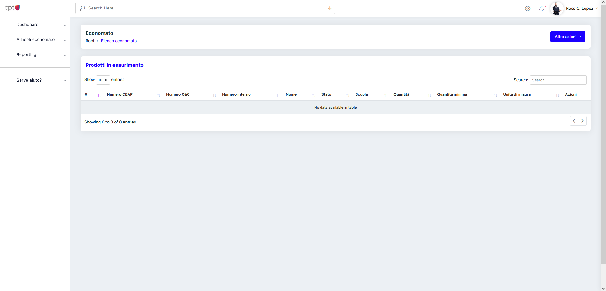
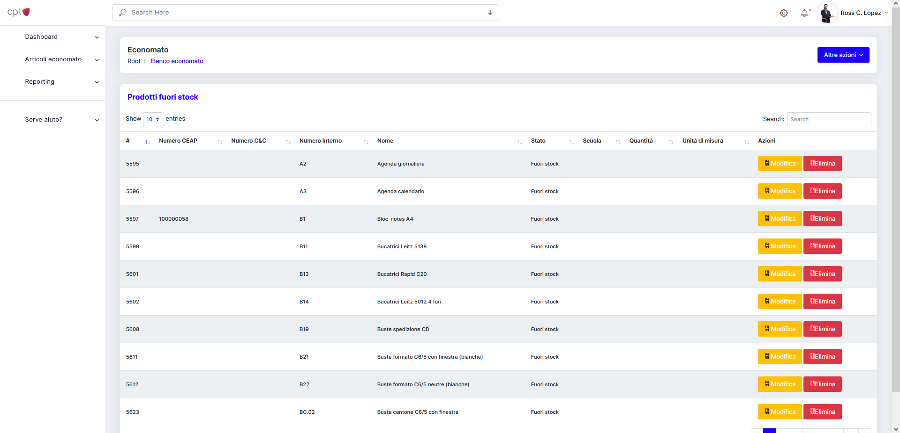

## Panoramica

Questa schemata si presenta con una tabella che contiene tutti gli articoli dell'economato.

La tabella che contiene gli articoli, è possibile filtrarla, per ordine ascendente o discendente, cliccando l'icona di ordinamento, 
posizionata accanto al nome della colonna.

Con il pulsante <strong>"Altre opzioni"</strong> è possibile visualizzare diverse viste predefinite per l'esaurimento dei prodotti.

Per creare un nuovo prodotto si passa dal pulsante <strong>"Altre opzioni" > "Nuovo articolo"</strong>

### Prodotti in esaurimento

Tramite il pulsante <strong>"Altre opzioni" > "Mostra prodotti in esaurimento"</strong>, è possibile visualizzare tutti i prodotti che stanno esaurendo.
Per esaurire si intende quando la quantità attuale scende sotto la quantità minima impostata per il prodotto. La schermata si presenta cosi:

### Prodotti fuori stock

Tramite il pulsante <strong>"Altre opzioni" > "Mostra prodotti fuori stock"</strong>, è possibile visualizzare 
tutti i prodotti che non sono più distribuiti dal fornitore (CEAP).
Per fuori stock si intende quando il campo "Data FINE validità" è stato impostato su una data precedente alla data corrente.

## Eliminazione articolo

Dalla pagina è possibile eliminare ogni singolo articolo presente nell'inventario. Per farlo basta cliccare <strong>Elimina</strong> 
sulla riga dell'articolo desiderato. 

Una volta eliminato con successo l'articolo verrà visualizzato un messaggio di conferma.

